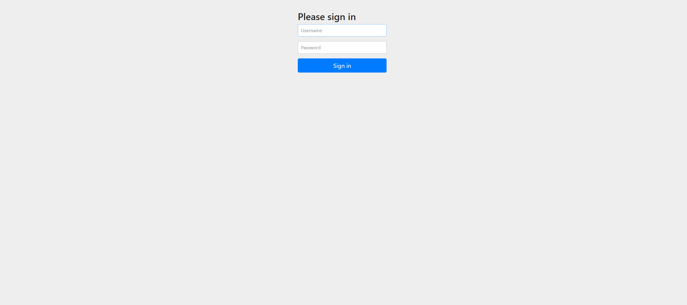

# Movie Catalog Backend

## Overview
Backend built with Java and Spring Boot for a movie catalog application and for storing information about movies, directors and reviews.

## Deployment
There is a dockerfile included so the application can deployed on a hosting platform like render.

## Application Screenshots
<div style="display: flex; flex-wrap: wrap; gap: 10px;">
  
  
  
  
</div>

## Features
- **Logging in**: The purpose of this backend is to function as a management tool for the catalogue so it requires logging in with an admin user.
- **Data Management**: User can view, add, update and delete existing data meaning movies, their directors and reviews.
- **Testing**: Application has implemented tests for all required database operations.

## Installation
1. Clone the repository:
    ```sh
    git clone https://github.com/joakha/Movie-Catalog.git
    ```

2. Install dependencies:
    This application is using using postgresql database, which can be downloaded from here:
    ```sh
    https://www.postgresql.org/download/windows/
    ```
    Documentation for setting up postgresql:
    ```sh
    https://www.postgresql.org/docs/
    ```

3. Environment Variables:
    1. Create a file called .env to the cloned project root
    2. Add following variables and their values for the application server port, database url, database
       username and password respectively: SERVER_PORT, DB_URL, DB_USERNAME_ DB_PASSWORD

4. Start development server the way you prefer

## Frontend

- There is a public frontend which is meant to be used alongside this application
- Frontend repository: https://github.com/joakha/movie-catalog-front-ts

## Dependencies

### Spring Boot Starters:

- spring-boot-starter-thymeleaf – Enables Thymeleaf templating engine.
- spring-boot-starter-web – Provides core web functionalities.
- spring-boot-starter-data-jpa – Enables JPA (Java Persistence API) support.
- spring-boot-starter-security – Adds security features such as authentication and authorization.
- spring-boot-starter-validation – Provides input validation support.

### Database:

- postgresql – PostgreSQL JDBC driver for database connectivity.

### Security:

- thymeleaf-extras-springsecurity6 – Adds Spring Security support for Thymeleaf templates.

### Development Tools:

- spring-boot-devtools – Enables live reload for development.

### Testing:

- spring-boot-starter-test – Provides testing utilities.
- spring-security-test – Enables Spring Security testing support.
